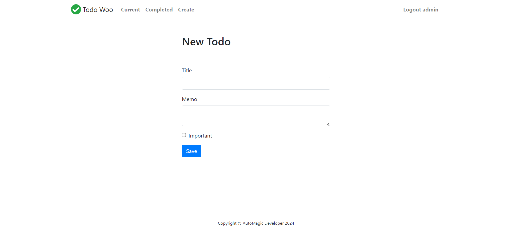
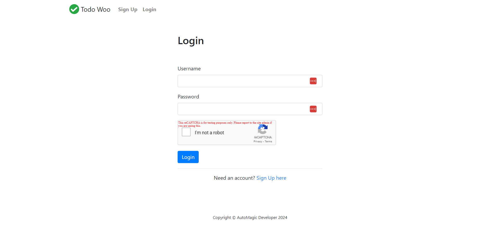

[![LinkedIn][linkedin-shield]][linkedin-url]

<!-- PROJECT LOGO -->
 

    
  <h3 align="center">Todo Woo - Full Stack ToDo Management App</h3>

<!-- TABLE OF CONTENTS -->

  
Table of Contents

  <ol>
    <li>
      <a href="#about-the-project">About The Project</a>
      <ul>
        <li><a href="#business-case">Business Case</a></li>
        <li><a href="#technical-solution">Technical Solution</a></li>
        <li><a href="#screenshots">Screenshots</a></li>
        <li><a href="#tech-stack">Tech Stack</a></li>
      </ul>
    </li>
    <li><a href="#contact">Contact</a></li>
  </ol>

<!-- ABOUT THE PROJECT -->
## About The Project

* **Project Name:** Todo Woo - Full Stack ToDo Management App  
* **Version:** v1.0.0  

---

### Business Case

The **Todo Woo** project provides users with a robust platform to manage tasks and organize their to-do lists. This project demonstrates key web development concepts using Django, including authentication, CRUD operations, and query handling, making it ideal for learning full-stack website development with Python.

With **Todo Woo**, users can create an account, log in, and fully manage their tasks with options to add, update, and delete to-do items. The application also includes user-specific authentication, ensuring only logged-in users can access and manage their to-do lists.

(<a href="#readme-top">back to top</a>)

### Technical Solution

This project is structured as a full-stack Django application, running in a Docker Compose stack. The stack includes:
* **App Container**: Hosts the Django web application, which handles user requests and renders pages.
* **Postgres Database Container**: Stores user data, tasks, and app-related information.
* **Nginx Proxy Server Container**: Acts as a reverse proxy to handle client requests and direct them to the appropriate backend service.

Features:
* **User Authentication**: Users can sign up, log in, and log out securely.
* **Task Management**: Full CRUD capabilities, allowing users to create, view, update, and delete their tasks.
* **Model Relationships**: Establishes relationships between user accounts and tasks, allowing users to have unique task lists.
* **Query Filtering**: Filters tasks based on various parameters for easy organization.
* **Error Handling**: Manages errors gracefully to provide a smooth user experience.

(<a href="#readme-top">back to top</a>)

### Screenshots

#### Completed Todos Page

#### Home Page

#### Empty Todos List Page

#### Current Todos Page

#### Create a Todo Page

#### Login Page

#### Sign Up Page

(<a href="#readme-top">back to top</a>)

### Tech Stack

This project was developed using the following tech stack:

* **Django**
* **PostgreSQL**
* **Nginx**
* **Docker**

(<a href="#readme-top">back to top</a>)

<!-- CONTACT -->
## Contact

Mohamed AbdelGawad Ibrahim - [@m-abdelgawad](https://www.linkedin.com/in/m-abdelgawad/) - <a href="tel:+201069052620">+201069052620</a>

(<a href="#readme-top">back to top</a>)

<!-- MARKDOWN LINKS & IMAGES -->
[linkedin-shield]: https://img.shields.io/badge/-LinkedIn-black.svg?style=for-the-badge&logo=linkedin&colorB=555
[linkedin-url]: https://www.linkedin.com/in/m-abdelgawad/
